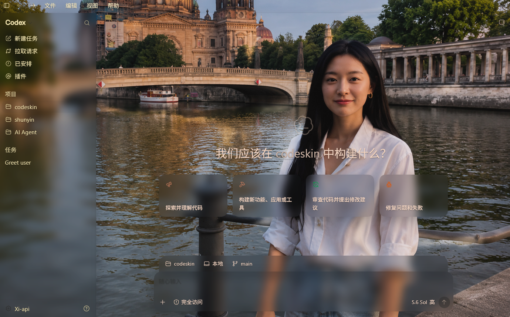
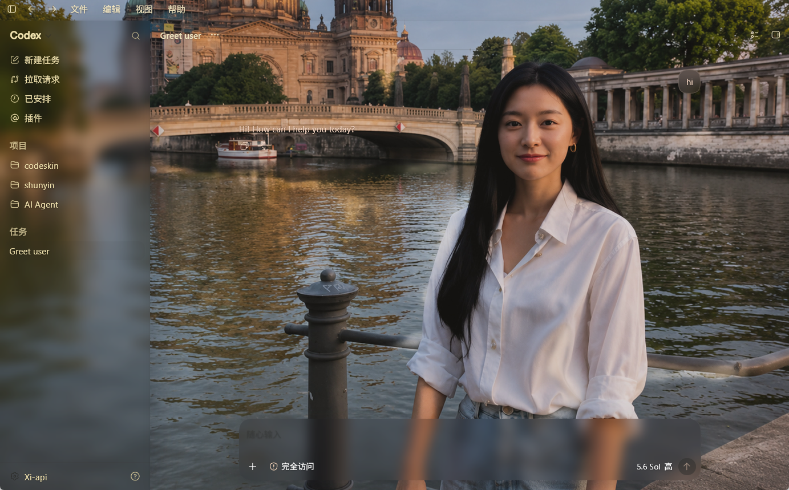
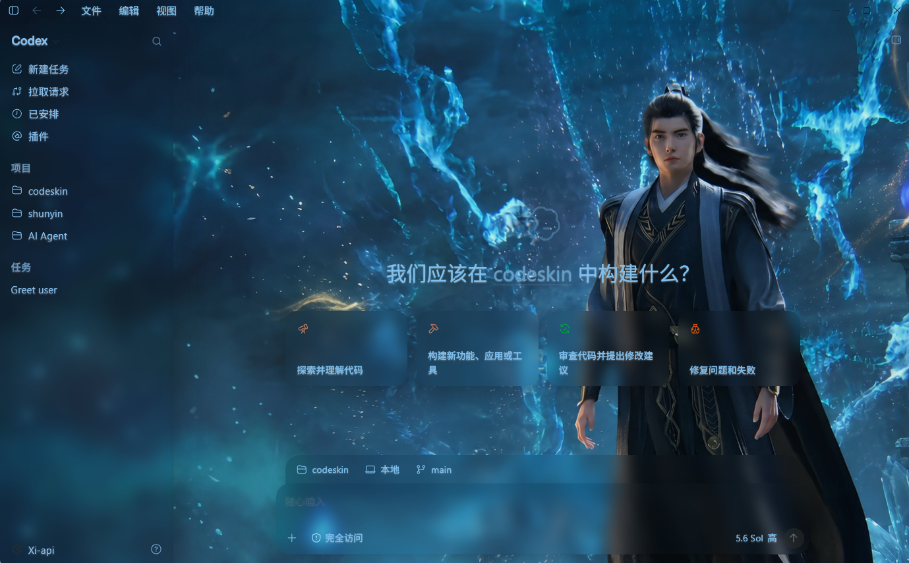
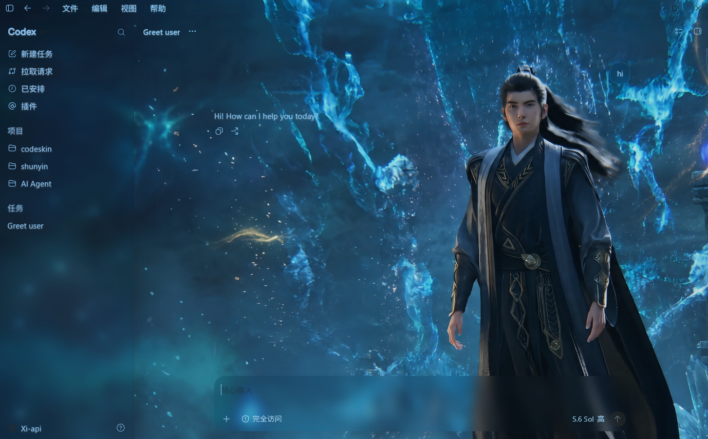
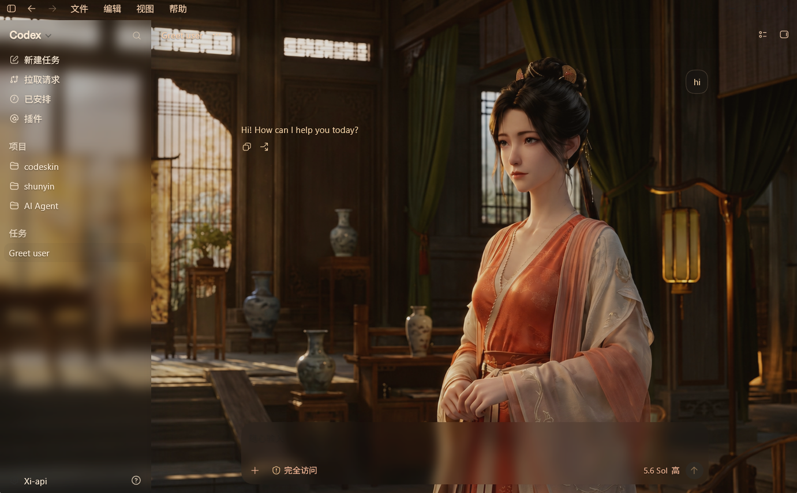
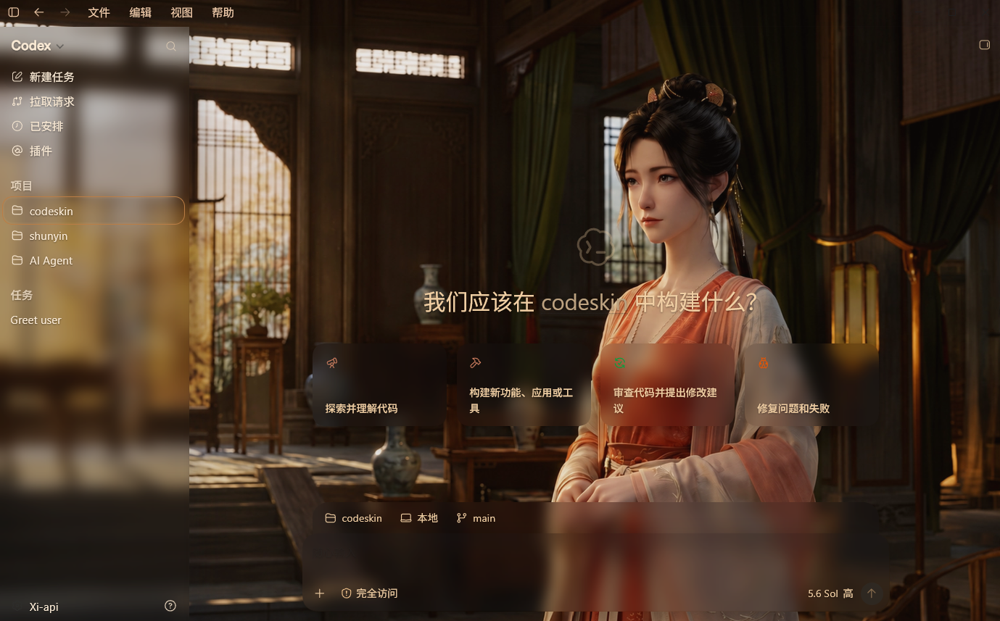
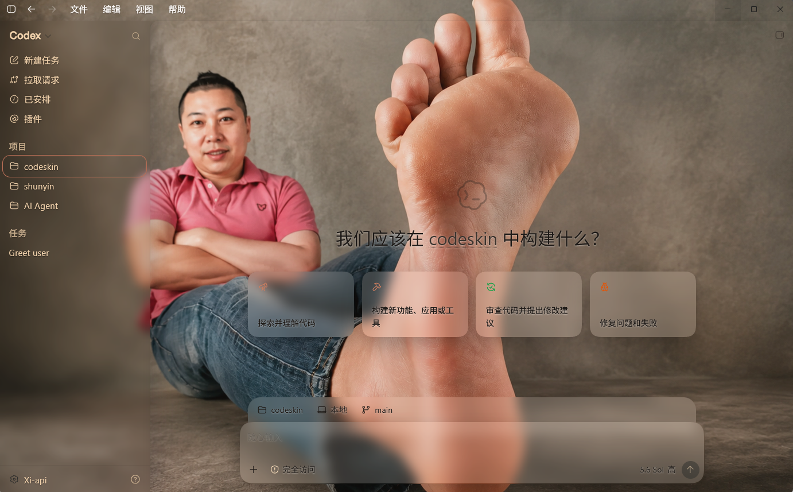
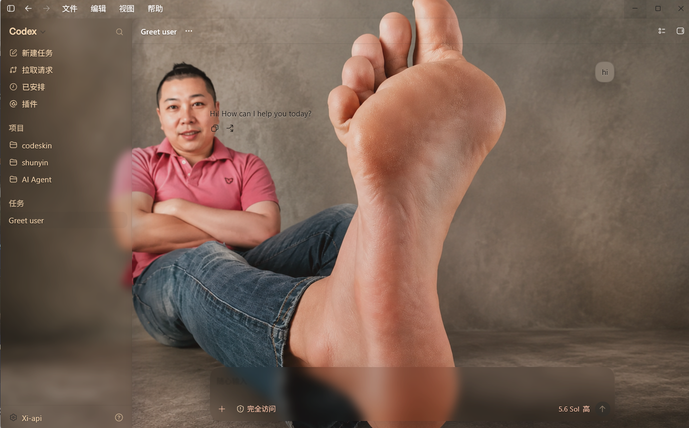

# CodeSkin

中文版：[README.md](../../README.md)

**Give your Codex desktop a digital outfit that breathes with the rhythm of the moment.**

- **Dynamic visual aesthetics**: Break away from rigid dark/light modes and inject breathing motion and subtle layered effects into Codex, so a productivity tool can also feel artistic.
- **Immersive theme customization**: Redesign the visual layer deeply. Whether you want a frosted-glass look or cyberpunk neon, it can be delivered without changing the official interaction logic.
- **Seamless and elegant persistence**: Powered by local CDP runtime rendering, the custom theme is applied directly to the interface. No unpacking or modification of official files is required.

## Sponsors

<p align="center">
  <a href="https://api.shunyin.eu.cc/sign-up?aff=P5tA">
    
  </a>
</p>

<p align="center">
  <strong>Smarter Links, Freer Creation</strong><br>
  <sub>Intelligent connectivity · free creativity</sub>
</p>

<p align="center">
  Thanks to <a href="https://api.shunyin.eu.cc/sign-up?aff=P5tA"><strong>XIAI Transit</strong></a> for sponsoring this project.<br>
  Full-power AI relay: direct access to official models, no downgrade, no wrapper; connect Codex / Claude Code with a single configuration.
</p>

<p align="center">
  <sub>
    Theme skinning and API configuration are independent; this project will not automatically rewrite your model provider settings.
  </sub>
</p>

## What You Can Do With It

- **Seamless native experience**: From the input box to the sidebar, the original Codex interaction remains intact. This is not a static wallpaper, but a customized desktop experience.
- **Non-intrusive dynamic loading**: Using local CDP technology, the theme is injected at runtime without polluting any local files.
- **Easy switching**: Use it if you like, switch away if you don't. Restore the skin layer with one click and return to the original state instantly.
- **Strict security boundaries**: The injection channel is only exposed to localhost (127.0.0.1), leaving no vulnerability for external network access.

## Real-World Effect Showcase

> 🎨 If you need background images or more materials, you can browse the [readme-image directory](https://github.com/lntomF/codexskin/tree/main/readme-image).

> **Real-device test**: All images below are taken from real devices. The sidebar, input box, and suggestion cards are all native Codex controls and support full interaction.

<table align="center">
  <tr align="center" style="font-weight: bold; background-color: transparent;">
    <td>⚡ IU </td>
    <td>✨ Kimjiwon</td>
  </tr>
  <tr align="center">
    <td width="50%">
      
      
    </td>
    <td width="50%">
      
      
    </td>
  </tr>
  <tr align="center" style="font-weight: bold; background-color: transparent;">
    <td>  HanLi  </td>
    <td>  MuPeiling  </td>
  </tr>
  <tr align="center">
    <td width="50%">
      
      
    </td>
    <td width="50%">
      
      
    </td>
  </tr>
  <tr align="center" style="font-weight: bold; background-color: transparent;">
    <td>  YuJie  </td>
    <td>  KUN  </td>
  </tr>
  <tr align="center">
    <td width="50%">
      
      
    </td>
    <td width="50%">
      
      
    </td>
  </tr>
</table>

## Quick Start

Currently only **Windows** is supported (other platforms are not yet adapted).

### Recommended method: Download the Windows installer (regular users)

Go to the [Releases](https://github.com/lntomF/codexskin/releases) page and download the latest Windows installer:

- `CodeSkin_*_x64-setup.exe`: Windows 64-bit installer

After downloading, double-click the installer and follow the wizard to complete the installation.

> If Windows SmartScreen shows “Unknown Publisher”, it is usually because the current installer has not yet been code-signed.
> Please confirm that the installer comes from the official Releases page of this project.

After installation, you can launch CodeSkin from the Start menu or desktop shortcut.

### Developers: Build from source

If you want to build CodeSkin yourself, prepare the following environment first:

- Windows
- Node.js and npm
- Rust stable toolchain
- Visual Studio C++ Build Tools (MSVC)
- Microsoft Edge WebView2 Runtime

Clone the project and install frontend dependencies:

```powershell
git clone https://github.com/lntomF/codexskin.git
cd codexskin
npm ci
```

Run the following at the project root:

```powershell
npm.cmd run build:desktop
```

The production executable will be generated at:

```text
src-tauri\target\release\codeskin.exe
```

You can run the generated `codeskin.exe` directly. The production package uses embedded frontend assets and does not depend on a development server or `localhost:1420`.

## Theme Persistence and Runtime Limits

CodeSkin saves the theme/wallpaper information you recently selected. However, the wallpaper display itself is a runtime effect injected into the currently running Codex window via CDP, rather than being written into official Codex files or the installation directory.

Please keep the following in mind:

- While CodeSkin is running, it can connect to Codex and apply the saved theme.
- If you completely exit CodeSkin and then start a new Codex from the native Codex icon, command line, or other entry point, the new window will not automatically carry the background. This does not mean the theme configuration is lost; it just means there is no running CodeSkin to inject via CDP into the new process.
- To display the saved theme again, restart CodeSkin and then reconnect/apply the theme to the current Codex window.
- CodeSkin does not modify official Codex files, `app.asar`, the installation directory, or code signatures; therefore it does not provide the ability to permanently rewrite the appearance of future Codex windows after CodeSkin has exited.

> If you want every newly opened Codex window to restore the theme automatically, CodeSkin must remain running to monitor and inject new windows, or a future dedicated “launch Codex with theme” entry point may be provided. The ordinary native Codex startup path will not trigger injection automatically.

## Usage Rules

- If Codex Desktop is already running and has no CDP port, exit it normally from the interface first, then launch it through CodeSkin. Do not terminate the process directly.
- After applying a theme, you can run verification. Using “Restore” removes the wallpaper/style layer injected by CodeSkin.
- To restore the official appearance, click “Restore” in CodeSkin. Simply exiting CodeSkin will not write the runtime style already injected into the current Codex window into official files.

## Wallpaper Requirements

- Supports PNG, JPEG, and WebP
- Maximum file size is **12 MiB**; image width and height must not exceed **8192 pixels**
- Wallpapers are only used for CodeSkin’s temporary runtime visual layer and will not rewrite official Codex resources

## Feedback and Contributions

Feel free to submit bug reports or feature suggestions via [Issues](https://github.com/lntomF/codexskin/issues), and PRs are also welcome. Before submitting, it is recommended that you verify the full “apply theme → restore” workflow yourself.

- [Contributing guide](CONTRIBUTING.md): development, documentation, testing, and theme submissions
- [Notice](NOTICE.md): code/documentation license scope and visual-asset exclusions
- [Asset policy](ASSET_POLICY.md): only original or clearly redistributable assets are accepted
- [Security policy](SECURITY.md): report security concerns privately, not through public Issues
- [Support guide](SUPPORT.md): where to ask for help or report a problem
- [Roadmap](ROADMAP.md): near-term priorities, community goals, and non-goals
- [Code of conduct](CODE_OF_CONDUCT.md): expectations for respectful community participation
- [MIT License](LICENSE.md): canonical license text and the non-binding Chinese reference
- [中文文档](../../README.md): Chinese project homepage and collaboration documentation

## Security Boundary

- CDP is bound only to the `127.0.0.1` loopback address. During theme runtime, do not run untrusted local programs.
- It does not modify the official installation directory, `app.asar`, or code signatures.
- It does not read or rewrite API keys, base URLs, or other model provider configuration.

## Acknowledgments

This project references excellent Codex skinning projects:

- [Fei-Away/Codex-Dream-Skin](https://github.com/Fei-Away/Codex-Dream-Skin) — Windows PowerShell startup approach (including `Test-CDP`, `Start-Process`, and path probing), plus the light/dark auto-adaptation concept.

## Compatibility Notes

- Currently only Windows is supported.
- CodeSkin depends on the local CDP capability of Codex Desktop.
- If Codex updates, changes in page structure or startup parameters may cause injection to fail.
- If anything goes wrong, first click “Restore Official Appearance,” then report the issue.
- When submitting an issue, include your Windows version, Codex version, and error information.

## Disclaimer

CodeSkin is a personal, unofficial project and is not affiliated with OpenAI / Codex. No warranty is provided; all risks of using this tool are borne by the user.

---

Star it, pick a picture you like, and turn Codex into the look you want today.
